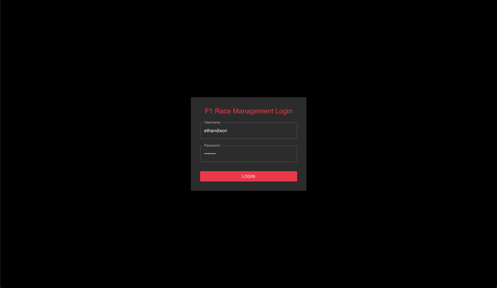
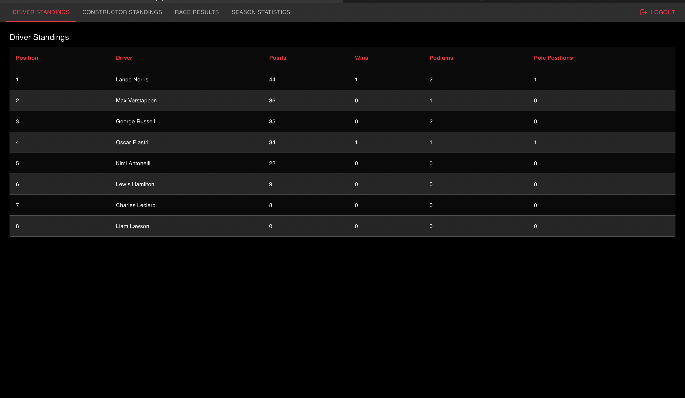
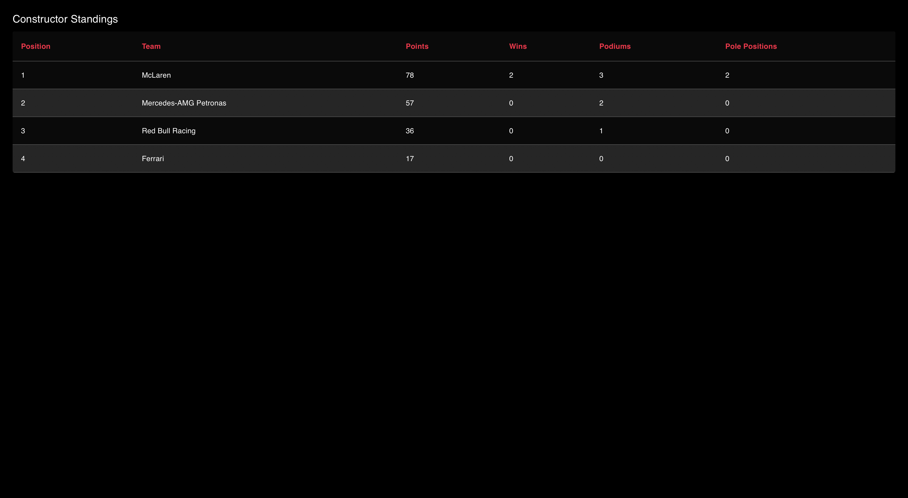
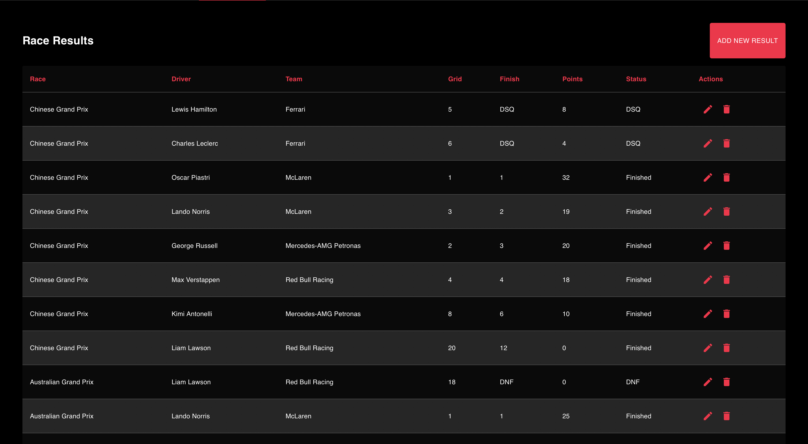
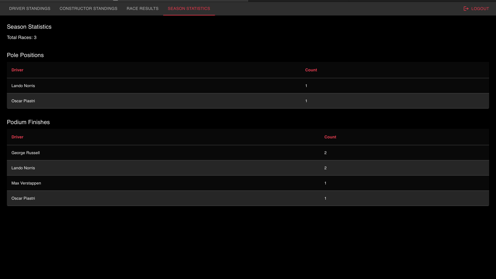
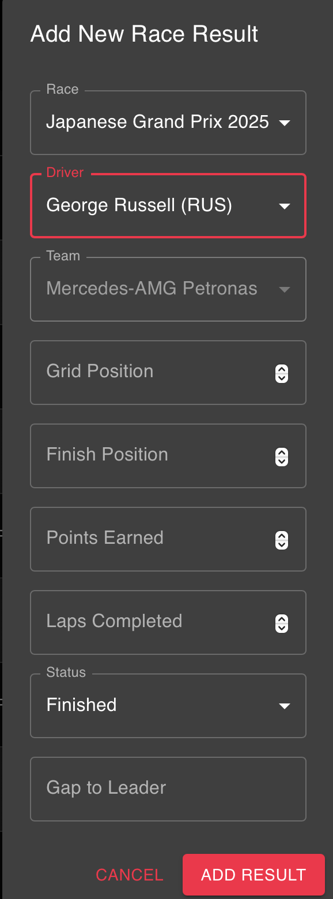

# F1 Race Management System

A full-stack web application for managing Formula 1 race data, including drivers, teams, race results, and statistics. Built with React for the frontend and Flask for the backend.

## Features

- Driver standings and statistics
- Team standings and performance metrics
- Race results management
- Season statistics
- User authentication system
- Admin dashboard for data management

## Tech Stack

### Frontend
- React
- Material-UI
- Axios for API communication

### Backend
- Flask
- SQLAlchemy
- SQLite database
- Flask-Login for authentication
- Flask-CORS for cross-origin support

## Prerequisites

- Python 3.8 or higher
- Node.js 14.0 or higher
- npm (Node Package Manager)

## Setup Instructions

### Windows

1. **Clone the Repository**
   ```bash
   git clone https://github.com/dixon140/f1_app.git
   cd f1_app
   ```

2. **Backend Setup**
   ```bash
   cd server
   python -m venv venv
   venv\Scripts\activate
   pip install -r requirements.txt
   ```

3. **Create Admin User**
   ```bash
   flask create-admin
   # Follow the prompts to create an admin account
   ```

4. **Run the Backend Server**
   ```bash
   python app.py
   ```
   The server will start at `http://127.0.0.1:5000`

5. **Frontend Setup**
   ```bash
   cd ../client
   npm install
   ```

6. **Run the Frontend**
   ```bash
   npm start
   ```
   The application will open at `http://localhost:3000`

### macOS/Linux

1. **Clone the Repository**
   ```bash
   git clone https://github.com/dixon140/f1_app.git
   cd f1_app
   ```

2. **Backend Setup**
   ```bash
   cd server
   python3 -m venv .venv
   source .venv/bin/activate
   pip install -r requirements.txt
   ```

3. **Create Admin User**
   ```bash
   flask create-admin
   # Follow the prompts to create an admin account
   ```

4. **Run the Backend Server**
   ```bash
   python app.py
   ```
   The server will start at `http://127.0.0.1:5000`

5. **Frontend Setup**
   ```bash
   cd ../client
   npm install
   ```

6. **Run the Frontend**
   ```bash
   npm start
   ```
   The application will open at `http://localhost:3000`

## Usage

1. Access the application at `http://localhost:3000`
2. Log in with your admin credentials
3. Use the navigation menu to access different sections:
   - Dashboard for overview
   - Drivers standings
   - Team standings
   - Race results
   - Season statistics

## Application Pages

### Login Page


The login page provides secure authentication for users. It features:
- Username and password authentication
- Error handling for invalid credentials
- Clean and intuitive interface

### Drivers Standings


The drivers standings page shows:
- Current championship standings
- Points per driver
- Race wins and podiums
- Sorting by points

### Team Standings


The team standings page displays:
- Constructor championship standings
- Total team points

### Race Results


The race results page features:
- Detailed race-by-race results
- Comprehensive race information

### Season Statistics


The season statistics page provides:
- Season stats for players

### Admin Dashboard


The admin dashboard allows for:
- Data management and updates

## Development

- Backend API runs on `http://127.0.0.1:5000`
- Frontend development server runs on `http://localhost:3000`
- The frontend proxy is configured to forward API requests to the backend

## Database

The application uses SQLite for data storage. The database file (`f1_database.db`) is located in the server directory.
